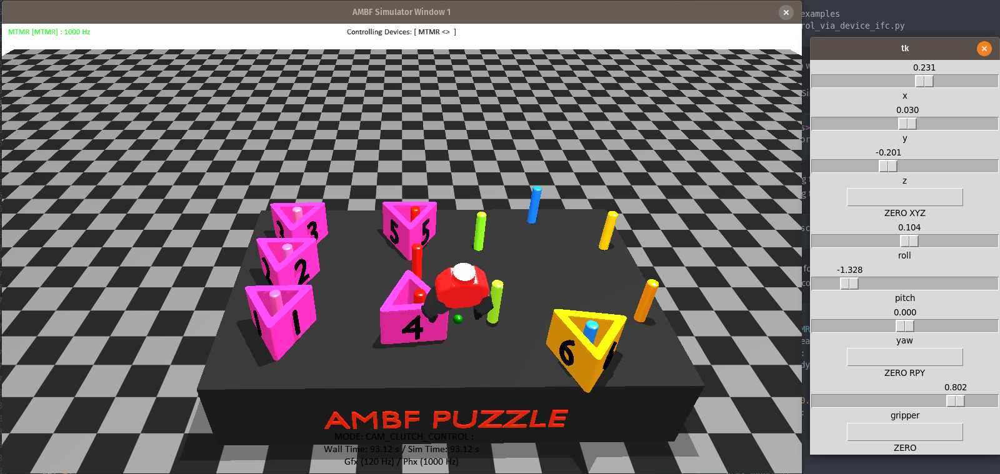
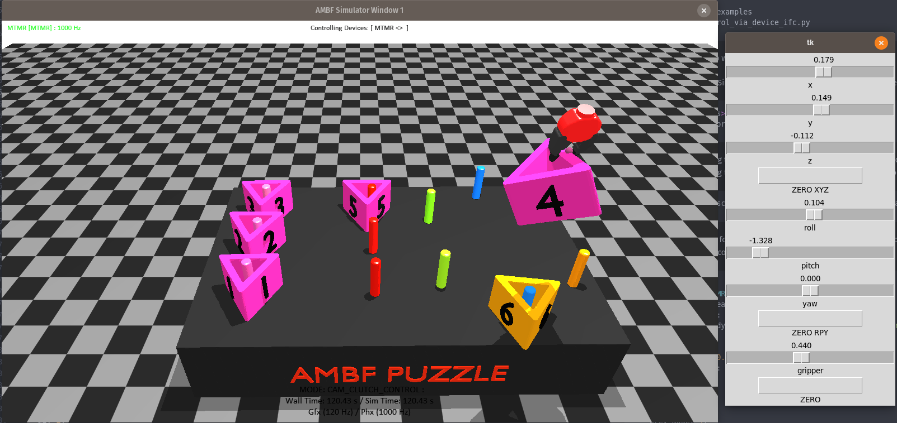

### README

Examples on how to use these files.

The two executable files in the folder are:

1. `gripper_control_via_device_ifc.py`
2. `gripper_control_via_client_ifc.py`

# 1. Gripper Control Via Device Interface

This file leverages the MTM Device interface implemented in the core of
AMBF to trick it to think that there is an MTM connected to the system.
This is where the driver is defined

```
ambf/external/chai3d/src/devices/CdVRKDevices.h
ambf/external/chai3d/src/devices/CdVRKDevices.cpp
```

The file `<ambf>/external/chai3d/src/devices/CdVRKDevices.cpp` sets base and tip transforms for
the dVRK device to match the AMBF frame convention. Since we are not using the real dVRK hardware in this example,
we invert those set base and tip transforms in the `proxy_device.py` in this example.
The end results is that the control frame matches the AMBF convention, so X is towards you, Y is right and Z in upwards.

If you are interested, these are the relevant lines in the `proxy_device.py` file.

```python
if arm_name == 'MTMR':
        self._mtm_arm_type = 0
        self.base_frame.M = Rotation.RPY(0.0, 0, 1.57079)
        self.tip_frame.M = Rotation.RPY(0, -1.57079, 0)
    elif arm_name == 'MTML':
        self._mtm_arm_type = 1
        self.base_frame.M = Rotation.RPY(0.0, 0, 1.57079)
        self.tip_frame.M = Rotation.RPY(0, -1.57079, 0)
```

Now, you can test this example as follows

1. First, run the python file

``` bash
cd gripper_control_examples
python gripper_control_via_device_ifc.py
```

You shall see a GUI popup with sliders to control x, y, z, roll, pitch, yaw and
gripper open and close slider.

2. Then run the AMBF simulator with the ADF file of your choice. We are going to
use a surgical training puzzle scene in this example.
``` bash
cd ambf/bin/<os>
./ambf_simulator -l16 -i0
```

3. Since we are tricking the device driver to think that an MTM is connected to
the system, you shall see that the AMBF simulator automatically spawns a gripper
representing the MTM device. The gripper to be loaded can be set in the
following file:

```
ambf/ambf_models/descriptions/input_devices/input_devices.yaml
```

See the following snippet for dVRK MTMR. The field called simulated multibody
is the ADF file (gripper multibody) that is loaded. You can open that specific
multibody to examine its contents.

``` python
MTMR:
  hardware name: MTMR
  haptic gain: {linear: 0.03, angular: 1}
  workspace scaling: 5
  simulated multibody: "../multi-bodies/grippers/pr2 gripper small red.yaml"
  # root link:
  location: {
    position: {x: -0.5, y: 0, z: 0},
    orientation: {r: 0, p: 0, y: 0}}
  button mapping: {
    a1: 1,
    a2: 2,
    next mode: 3,
    prev mode: 4}
  pair cameras: [camera1, camera2] # The motion of the IID-SDE is w.r.t the first camera in the list
```

4. This gripper can now be controlled via the GUI
that spawned from step 1.

This is an example of what you should see:





# 2. Gripper Control Via Client Interface
This is the probably the better and more programmatic way to control a gripper
if you are using an algorithm and don't want to bother with hidden implementations
and frame transformations.

In this example, we are going to be relying on the features of the AMBF client
which are meant for generic control purposes.

1. Since we are not using the AMBF Device interface, we shall have to spawn
the gripper in the simulation manually. To do this, we can just add its multibody
at launch. For this example, we can use one of the grippers found here

```
ambf/ambf_models/descriptions/multi-bodies/grippers/pr2 gripper.yaml
```

``` bash
cd ambf/bin/<os>
./ambf_simulator -l 16 -a ambf/ambf_models/descriptions/multi-bodies/grippers/pr2 gripper.yaml
```

You should see the simulation with the puzzle and the gripper just laying there.

2. Now run the following python code.

``` bash
cd gripper_control_examples
python gripper_control_via_client_ifc.py
```

A GUI similar to the one in the previous control example will popup. You can use the sliders
and gripper button to move the gripper and open and close it. This Example uses
the default coordinate frame of AMBF so it is easier to adopt in your code.

3. You will find that in the gripper multibody file (ADF file)
`ambf/ambf_models/descriptions/multi-bodies/grippers/pr2 gripper.yaml` we have
defined a proximity sensor and a constraint actuator. You can inspect the code
in the file `gripper_control_via_client_ifc.py` as well. As you shall find out,
we are manually checking if a sensor is triggered, and if triggered,
we get the name of the body that is sensed and then use this sensed body's name in
the actuator to attach the body to the actuator.
