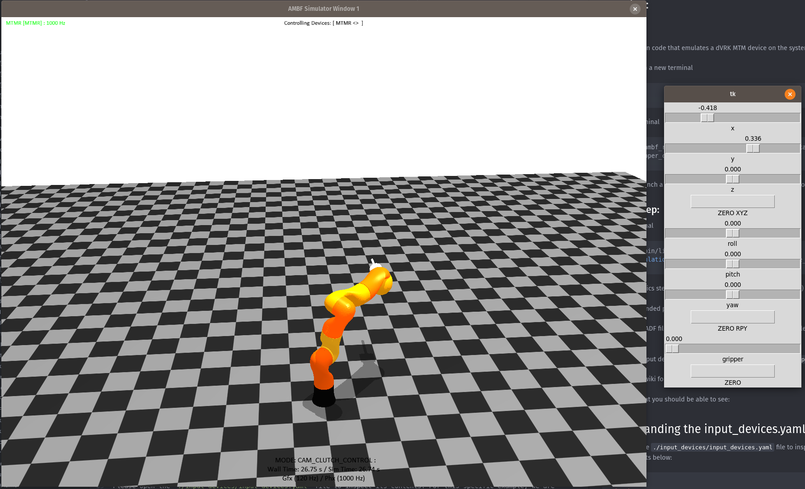
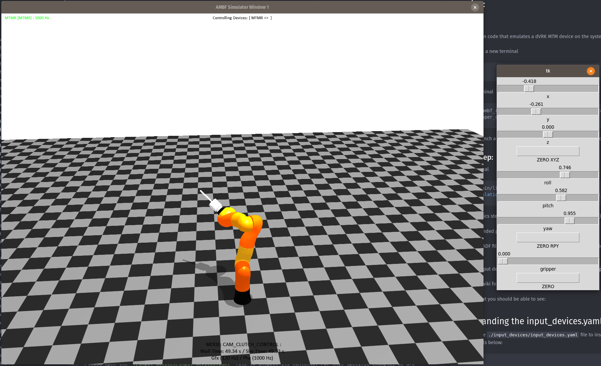
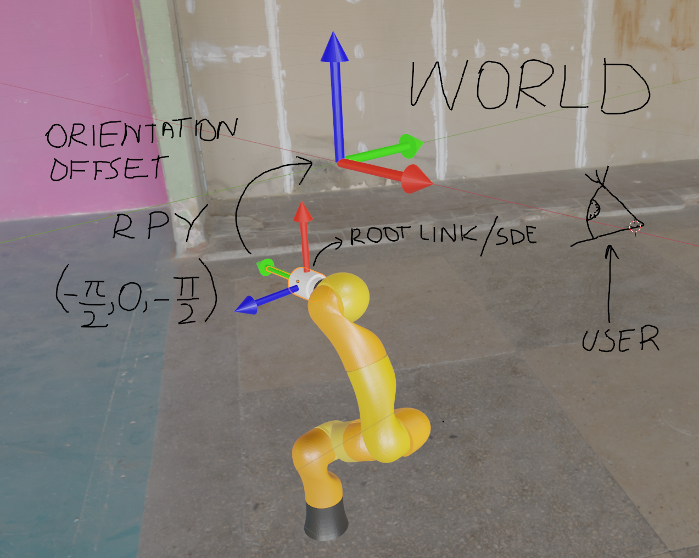

# Input Device Teleop

## 1. Usage
For everyone to be able to use this example, we are utilizing the dVRK MTM haptic device for the sole reason that it has a ROS based driver and thus we can emulate its presence without requiring access to the physical hardware.

For your use cases, if you have a specific haptic device that works with AMBF (and CHAI-3D), please edit
the `./input_devices/input_devices.yaml` file in this example.

Some terminology:
Let's call the absolute location of ambf root folder `<ambf>`.
Let's call the absolute location of this folder `<input_device_teleop_example>`.

Please resolve the actual path of `<ambf>` and `<input_device_teleop_example>` in the examples below.

Terms used in this document

__IID__ Input Interface Device, which is our input device.

__SDE__ Simulated Dynamic End-Effector. This is the rigid body that is bound to the IID. It is also referred
to as the `root link` in this document.


### 1.1 Running:

#### First Step:
Start the Python code that emulates a dVRK MTM device on the system.

Start roscore in a new terminal
``` bash
roscore
```
In another terminal
``` bash
cd <ambf>/ambf_ros_modules/examples/gripper_control_examples
python gripper_control_via_device_ifc.py
```

This should launch a GUI with sliders that should allow you to control the Pose of the dVRK MTM IID.

#### Second Step:
In a new terminal
``` bash
cd <ambf>/bin/lin-x86_64
./ambf_simulator -p60 -t1 --launch_file <input_device_teleop_example>/launch.yaml -l10 -i0
```

__-t__, set the physics stepping to fixed/dynamic time-steps. (OPTIONAL)

__-p__, set the intended physics frequency in Hz. (OPTIONAL)

__-l__, loading the ADF file at the specified index in the `launch.yaml` file. We are purposefully setting an out-of-range index in this example to not load any model.

__-i__, select the input device from the header list (at the top) in the `input_devices.yaml` file. In this case dVRK MTMR is the 1st device (at index 0).

Check out the wiki for more details on command-line arguments.

You should see something along these lines:

<div style="text-align:center"></div>

and moving the slides on the Python GUI should move the `root link`.

<div style="text-align:center"></div>


## 2. Understanding the input_devices.yaml File:

Please open the `./input_devices/input_devices.yaml` file to inspect its contents. For this specific example, we are dealing with dVRK MTM so I am pasting only its contents below:

``` yaml
MTMR:
  hardware name: MTMR
  haptic gain: {linear: 0.03, angular: 1}
  workspace scaling: 1
  simulated multibody: "../blender-kuka-tip-sphere.yaml"
  root link: "kuka_tip"
  # location: {
  #   position: {x: 0.2839, y: 0.3299, z: 1.4126},
  #   orientation: {r: 1.57079, p: -1.57079, y: 0}} # Comment out location if you want the simulated body to be loaded at the location specified in its ADF file. Otherwise, you can override it
  orientation offset: {r: -1.57079, p: 0.0, y: -1.57079}
  # controller gain: {
  #   linear: {
  #     P: 20,
  #     I: 0.0,
  #     D: 0.0
  #     },
  #   angular: {
  #     P: 30,
  #     I: 0.0,
  #     D: 0.0
  #     }
  #   } # Comment the controller out to use the internal velocity based controller
  button mapping: {
    a1: 1,
    a2: 2,
    next mode: 3,
    prev mode: 4}
  pair cameras: [camera1] # The motion of the IID-SDE is w.r.t the first camera in the list
```

### *hardware name:*
This is the name of the input device as registered in Chai-3D. See the m_modelName parameters in `cpp` files in this folder:
`<ambf>/external/chai3d/src/devices/`

### *workspace scaling:*
For scaling the motion of the IID in simulation. A lower number scales the motion down and a higher number scales it up.

### *simulated multibody:*
To provide a separate ADF file to be loaded for the specific IID. This is an optional field if you provide the field.

### *root link:*
A rigid body within the `simulated multibody` (if defined), or a rigid body launched separately (by another ADF provided via __-l__ flag or __-a__ flag) in the simulation. If no `root link` is specified and a `simulated multibody` is defined, `ambf` will automatically find a root link for the `simulated multibody`. This would the rigid body with the least number of parents and may or may not be what you want. For example, if the `simulated multi-body` is a free-floating gripper, its palm link shall have the least number of parents (0) and would be set as the `root link`. On the other hand, if the `simulated multibody` is a robot such as the KUKA robot, its base link has the least parents (0) and would be set as the `root link`, this is probably not what you want as you would want to bind its end-effector as the `root link`. In our example, this is what we are doing

### *location:*
If set, the `root link` is set to that pose and if commented out, the location of that specific rigid body specified in the ADF would be used instead.


### *controller gain:*
If no controller gain is defined, `ambf` will look at the `root link` and copy over the values from its controller to be used for controlling the `root link` via the IID.

### *haptic gain:*
The linear and angular gains for scaling the force feedback for the IID. If you are new to ambf to testing out different configurations, start your simulation with __-e0__ flag to disable setting any forces to the haptic devices, or you can set the haptic gains to zero.

### *pair cameras:*
The cameras to be paired to an IID so that they can be controlled via the appropriate button on the IID. The first camera in the list of the cameras is the basis on which the linear and angular mapping of `root link` are resolved to. If you don't know what that is, ignore it for now. For this example that cameras are specified in `./world/world.yaml` and this world is included from the `launch.yaml` file.

### *orientation offset:*
The world in AMBF is aligned as follows: X towards you, Y towards your right, and Z upwards. If the `root link` has a mesh that is naturally aligned with the world, you can comment out the orientation offset, or set its RPY to (0, 0, 0).

Otherwise, the orientation offset is the rotation in terms of RPY that defines the angular offset between the aligned `root link` and the World frame. See the example below:

<div style="text-align:center"></div>
