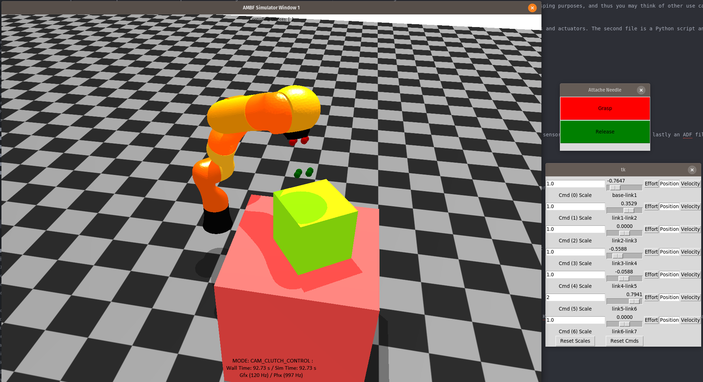
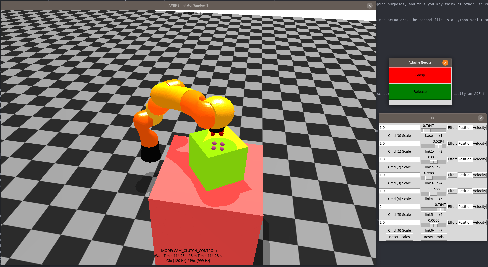
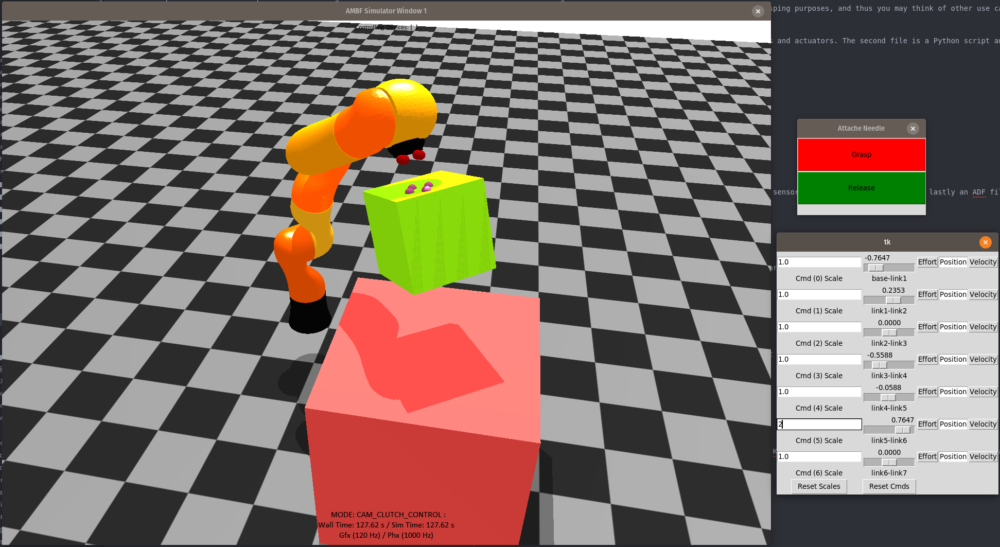

### Usage

This example demonstrates the process of defining sensors and constraint actuators and then attaching them to
rigid bodies. Please note that there is no direct relationship between a sensor and an actuator. However, in this example, we are using them for grasping purposes, and thus you may think of other use cases depending upon your application.

### Relevant Files
The two important files in this folder are `sensor_actuators.yaml` and `sensing_and_grasping.py`. The first file is an ADF file and describes sensors and actuators. The second file is a Python script and relies on the AMBF Python client to detect when a sensor detects an object, and based on this we can actuate a relevant constraint actuator.

### Usage:

`<ambf>` refers to the location of your ambf repository.

Run `roscore` in a new terminal.


``` bash
roscore
```

Now we are going to use a custom launch file as we require three ADF files for this example. In this launch file, we have a Kuka robot's ADF file, a sensor_and_actuator's ADF file, and lastly an ADF file comprising of a fixed table and a box on top. Run the launch file and all its ADF files as follows:

``` bash
cd <ambf>/bin/lin-x86_64/
./ambf_simulator --launch_file <ambf>/ambf_ros_modules/examples/sensors_actuators_example/launch.yaml -l 0,1,2
```
You should see a simulation scene with a Table, a Box, and a Kuka. The KUKA should also have spherical markers on its tip indicating the sensors (start and endpoints in red and green).

Now, we are going to run the `obj_control` script that will allow us to jog the Kuka robot to our desired pose. In a new terminal:

``` bash
cd <ambf>/ambf_ros_modules/examples/object_control_example/
python control_object.py -o base
```
You should see a GUI with joint sliders and buttons that should allow you to control the robot. Click the **Position** buttons for each joint so that the sliders control the joint positions.

Now, we are going to run the grasping script for this example. In a new terminal:

```bash
cd <ambf>/ambf_ros_modules/examples/sensors_actuators_example/
python sensing_and_grasping.py
```

Now you should see another GUI with two buttons labeled **Grasp** and **Release**. You can use the robot control GUI so that the end-effector of the KUKA comes near the box on the table. When it does, and when you click the grasp button, the box shall be grasped by the actuators attached to the end-effector. Clicking **Release** will release the object.

This is an example of what you should see:







### Note:
If you accidentally drop or misplace the box, you can click the simulation window and hit `CRTL + R` to reset the object poses in the simulation.
